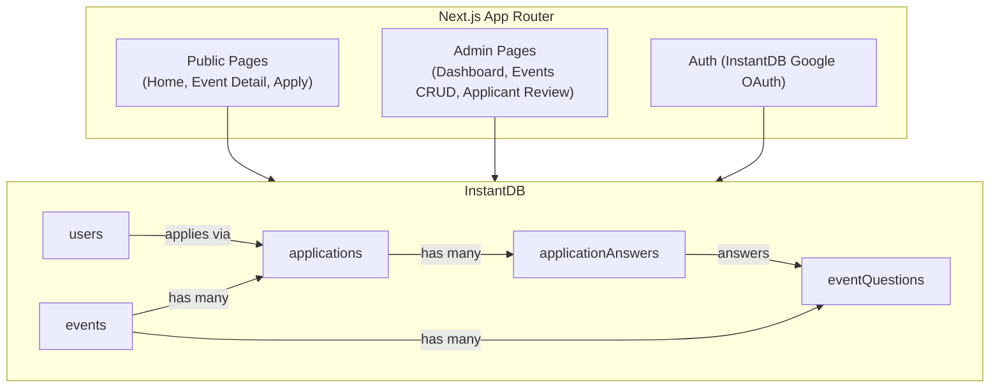
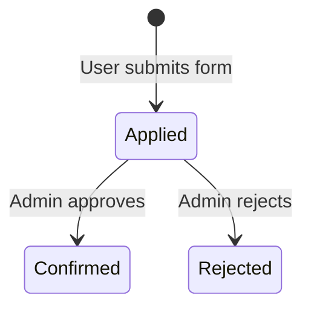

# YC Events Platform -- Implementation and UX Plan

## Data Summary

From `data/users.json`:

- **433 users** with fields: `id`, `first_name`, `last_name`, `email`, `linkedin`, `created_at`, `updated_at`, `last_login`
- Fields to ignore: `match_data`, `events` (attendance data), `username`, `password`
- 8 event names extracted from `events.event`: `ai-builders-salon-2026`, `climate-demo-day-2026`, `climate-night-2026`, `community-mixer-2026`, `founder-dinner-nyc-2026`, `hiring-webinar-2026`, `investor-breakfast-sf-2026`, `startup-hiring-hour-2026`

From `data/attendee_list.csv` (enrichment for matching users):

- **2,484 rows** from a past event registration (climate event)
- **13 users** match by email between `users.json` and `attendee_list.csv`
- For matched users only, enrich with: `location`, `linkedin`, `current_title_and_company`, `prior_title_and_company`, `school_and_degree`, `internal_notes`
- CSV columns used: `location`, `linkedin`, `current_title_and_company`, `prior_title_and_company`, `school_and_degree`, `internal_notes` (ignore `climate_interest_reason`, `status`, `created_at` for user enrichment)

## Architecture




## InstantDB Schema (`instant.schema.ts`)

Entities and relationships:

- **users** -- `id` (uuid), `firstName`, `lastName`, `email`, `linkedin`, `location`, `currentTitleAndCompany`, `priorTitleAndCompany`, `schoolAndDegree`, `internalNotes`, `isAdmin`, `createdAt`, `updatedAt`
  - `location`, `currentTitleAndCompany`, `priorTitleAndCompany`, `schoolAndDegree`, `internalNotes` are populated from `attendee_list.csv` when a user matches by email (13 users); otherwise null
- **events** -- `id`, `slug`, `title`, `description`, `date`, `endDate`, `location`, `status` (draft/published/closed/archived), `createdAt`, `updatedAt`
- **applications** -- `id`, `status` (applied/confirmed/rejected), `internalNotes`, `createdAt`, `updatedAt`, `reviewedAt`
  - Links to: `users`, `events`
- **eventQuestions** -- `id`, `questionText`, `required`, `order` (all questions render as textarea)
  - Links to: `events`
- **applicationAnswers** -- `id`, `answerText`
  - Links to: `applications`, `eventQuestions`

## Auth-to-User Mapping

InstantDB maintains its own `$users` auth table via Google OAuth. Our custom `users` entity holds profile data (name, isAdmin, location, etc.). The mapping works as follows:

1. **User clicks "Sign in"** -- triggers `db.auth.signInWithRedirect({ clientName: 'google-web', redirectURL: window.location.href })`
2. **Google OAuth completes** -- InstantDB creates/finds an entry in its internal `$users` table and returns `{ email, id (auth-id) }`
3. **App queries `users` by email** -- `db.useQuery({ users: { $: { where: { email: authUser.email } } } })`
4. **If match found**: use that `users` record as the current profile. Pre-fill forms with their data.
5. **If no match found**: create a new `users` record via `db.transact(tx.users[id()].update({ email: authUser.email, firstName: given_name, lastName: family_name, isAdmin: false, createdAt: new Date().toISOString() }))`. This covers brand-new signups who were never in users.json.
6. **Admin detection**: the `isAdmin` field on the `users` record gates access to `/admin` routes. The seed script sets `isAdmin: true` for designated admin emails.
7. **Logout**: `db.auth.signOut()` clears the InstantDB session. Frontend reverts to signed-out state.

The `$users` auth ID and the custom `users` entity ID are separate. They are linked by email (unique, lowercase-normalized). The app always reads profile data from the custom `users` entity, never from `$users` directly.

## Permissions (`instant.perms.ts`)

InstantDB permissions control server-side read/write access per entity. Rules reference `auth.email` (the logged-in user's email from `$users`).

**users**

- `view`: authenticated users can read their own record (`auth.email == data.email`). Admins can read all.
- `create`: allowed (for the sign-up flow when a new user creates their own record).
- `update`: users can update their own record. Admins can update any record (e.g. `internalNotes`).
- `delete`: admin only.

**events**

- `view`: anyone (including unauthenticated) can read events where `status == 'published'`. Admins can read all events regardless of status.
- `create / update / delete`: admin only.

**eventQuestions**

- `view`: anyone can read (questions are displayed on the public form).
- `create / update / delete`: admin only.

**applications**

- `view`: users can read their own applications (`auth.email == data.ref('users.email')`). Admins can read all.
- `create`: authenticated users can create an application linked to themselves.
- `update`: admins can update `status` and `internalNotes`. Users cannot modify their own application after submission.
- `delete`: admin only.

**applicationAnswers**

- `view`: users can read their own answers. Admins can read all.
- `create`: authenticated users can create answers linked to their own application.
- `update / delete`: admin only.

**Duplicate application guard**: the frontend checks for an existing application before showing the form. As an additional safeguard, a permission rule on `applications.create` can verify no existing application exists for the same `(user, event)` pair, or the app can check-then-create in a transaction.

## Page Structure and UX

### Public Pages

`**/` -- Home / Event Listing** (low priority, keep minimal)

- Simple list of published events linking to their detail pages (title, date, location)
- If logged in, show "Welcome, Name" in nav; if not, "Sign in"

`**/events/[slug]` -- Event Detail + Application** (matches the [PDF design](data/Event%20Form.pdf))

- **Hero banner**: Dark gradient with decorative circles, event title in large white text, date + location with icons
- **About section**: "ABOUT" label in orange, event title, rich-text description, bullet highlights
- **Application form** ("Request a spot"): Pre-fills name and email from logged-in user (with "edit" links). Custom questions configured per event (e.g., "What is your current Title and Role?", "Why is Climate Tech interesting to you?"). Orange "Request a spot" submit button.
- If not logged in, redirect to auth before showing form
- If already applied, show application status instead of form

### Admin Pages (protected, `isAdmin` check)

`**/admin` -- Dashboard**

- Summary stats: total events, total applications, pending reviews
- Quick links to manage events

`**/admin/events` -- Event List**

- Table of all events with status, date, applicant count
- "Create Event" button

`**/admin/events/new` and `/admin/events/[id]/edit` -- Event Form**

- Fields: title, slug (auto-generated from title), description (markdown/textarea), date, end date, location, status
- Custom questions builder: add/remove/reorder questions, set required flag (all questions render as textarea)

`**/admin/events/[id]/applicants` -- Applicant Review**

- This is the core admin workflow per the problem statement ("high-volume application review")
- Table/list of applicants with columns: name, email, linkedin, location, currentTitleAndCompany, priorTitleAndCompany, schoolAndDegree (from user profile when available), application answers, status, internal notes
- **Search bar**: Full-text search across all visible fields (name, email, linkedin, location, title, school, answers, notes)
- Bulk and individual actions: Confirm (approve), Reject
- Filter by status (applied, confirmed, rejected)
- Click-to-expand to see full application answers
- Inline internal notes field for each applicant
- Status flow: `applied` -> `confirmed` or `rejected`

## Application Status Flow




## Key Files

```
yc-events/
├── instant.schema.ts          # InstantDB schema definition
├── instant.perms.ts           # InstantDB permissions (admin vs user)
├── lib/
│   ├── instant.ts             # InstantDB client init + hooks
│   ├── seed.ts                # Seed script for users + events
│   └── utils.ts               # Shared utilities (slug generation, etc.)
├── app/
│   ├── layout.tsx             # Root layout (nav, auth provider)
│   ├── page.tsx               # Home / event listing
│   ├── events/
│   │   └── [slug]/
│   │       └── page.tsx       # Event detail + application form
│   ├── admin/
│   │   ├── layout.tsx         # Admin layout (sidebar, admin guard)
│   │   ├── page.tsx           # Admin dashboard
│   │   ├── events/
│   │   │   ├── page.tsx       # Event list
│   │   │   ├── new/
│   │   │   │   └── page.tsx   # Create event
│   │   │   └── [id]/
│   │   │       ├── edit/
│   │   │       │   └── page.tsx  # Edit event
│   │   │       └── applicants/
│   │   │           └── page.tsx  # Applicant review
│   └── components/
│       ├── LoginModal.tsx     # Google OAuth modal (triggered from nav/form)
│       ├── EventCard.tsx
│       ├── EventHero.tsx      # Hero banner matching PDF design
│       ├── ApplicationForm.tsx # "Request a spot" form
│       ├── ApplicantTable.tsx  # Admin review table
│       ├── QuestionBuilder.tsx # Admin question editor
│       └── Navbar.tsx
├── scripts/
│   └── seed.ts                # CLI seed script (bun run seed)
```

## Seed Script (`scripts/seed.ts`)

Reads `data/users.json` and `data/attendee_list.csv` via InstantDB Admin SDK:

**Users (433 records):**

- For each user, extract: `firstName`, `lastName`, `email`, `linkedin`, `createdAt`, `updatedAt`
- Generate a UUID for each user (replacing the numeric `id`)
- Skip `match_data` and `events` arrays entirely
- Build an email-indexed lookup from `attendee_list.csv` (normalize email to lowercase)
- For duplicate emails in CSV (1 case: `acollins@gmail.com`), keep the most recent row by `created_at`
- For each user: if `email` matches a CSV row, merge in `location`, `linkedin`, `currentTitleAndCompany`, `priorTitleAndCompany`, `schoolAndDegree`, `internalNotes` (CSV values override/supplement; prefer CSV when user has null linkedin and CSV has it)

**Events (8 records):**

- Collect the 8 unique event slugs from `events.event` fields in users.json and create event records with placeholder data (title derived from slug, status: "draft")

Uses `INSTANTDB_ADMIN_TOKEN` env var for admin access.

## Design System (from PDF)

- **Colors**: Dark navy/purple gradient for hero, orange (#F26522-ish) for CTAs and accents, white cards, light peach (#FDF0E9) background tint
- **Typography**: Large bold serif-like headings, clean sans-serif body text
- **Components**: Rounded cards with subtle shadows, pill-shaped date/location badges with icons, orange filled buttons with white text
- **Layout**: Centered content, max-width container, generous whitespace

## Implementation Order

Scaffold first, then build the two core loops (user applies, admin reviews), then polish with seed data and styling.