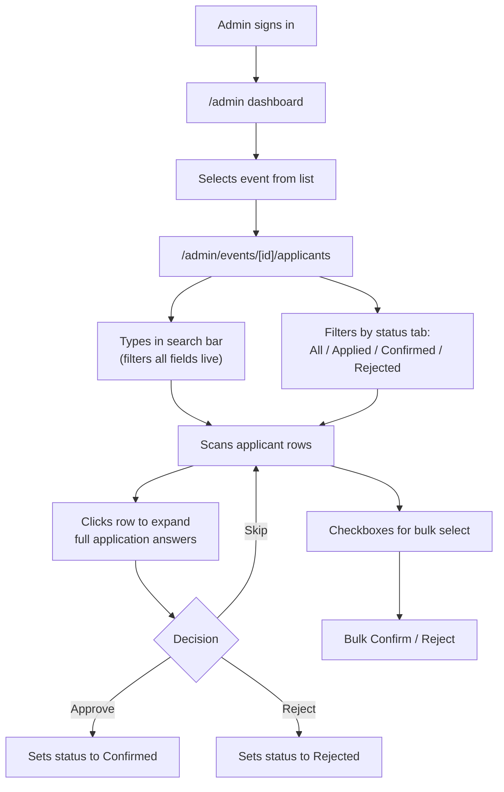

# YC Events Platform -- UX Plan

## User Flows

### Flow 1: Applicant applies to an event

### Flow 2: Admin reviews applicants

### Flow 3: Admin creates an event

---

## Screen Specifications

### Screen 1: Event Detail Page (`/events/[slug]`)

This is the primary public-facing page, matching the PDF design exactly.

**Navbar** (shared across all pages)

- Fixed top, full-width, transparent over hero on event pages
- Left: YC logo (orange "Y" in rounded square)
- Right: "Welcome, {name}!" + "Sign out" link (when authenticated) or "Sign in" link

**Hero Section** (full-width, ~400px tall)

- Background: CSS gradient from dark navy (#1B1340) to deep purple (#2D1B69), overlaid with decorative semi-transparent circles of varying sizes (CSS or SVG, not images)
- Circles: mix of outlined (border only, white ~10% opacity) and filled (white ~5% opacity), random positions, some extending beyond edges
- Small orange/coral accent dots scattered
- Content centered vertically and horizontally:
  - Event title: large white text, serif font (e.g. Georgia or a Google Font like Playfair Display), ~48-56px, max 2 lines
  - Below title: row of two metadata badges
    - Calendar icon + formatted date (e.g. "Friday, February 27 at 4pm")
    - Location pin icon + location (e.g. "San Francisco, CA")
    - White text, ~14px, separated by spacing

**About Card** (centered, max-width ~680px, white background, rounded corners, shadow)

- Vertical padding: ~48px top/bottom, ~40px sides
- "ABOUT" label: orange (#F26522), small caps, centered, ~12px tracking-wide
- Event title: repeated below label, dark text, serif font, ~28px, centered
- Description: body text, left-aligned, ~16px, line-height 1.6, standard sans-serif
- Supports paragraphs and bullet lists

**Application Form Section** (below About card)

- Background: light peach tint (#FDF0E9) on left/right margins, white center
- White card area, same max-width as About card
- **Header**: "Request a spot" in bold ~20px, followed by helper text: "We'll reach out with details if we're able to confirm your attendance."
- **Pre-filled fields** (row of two):
  - "Your name": shows "{First} {Last}" with an "(edit)" link in blue
  - "Your email": shows email with an "(edit)" link in blue
  - Clicking "(edit)" turns the value into an editable input
- **Dynamic questions** (stacked vertically, from eventQuestions):
  - Label above each: question text + red asterisk if required
  - All render as textarea inputs
  - Light gray border, rounded, comfortable padding
- **Submit button**: "Request a spot", orange/coral (#F26522) background, white text, rounded-full, centered, ~160px wide
- **Already-applied state**: Replace entire form section with a status card showing the current status (Applied / Confirmed / Rejected) with appropriate color coding

### Screen 2: Home Page (`/`) -- Minimal

- Navbar (same as above)
- Centered heading: "YC Events"
- Simple vertical list of published events, each row showing:
  - Event title (link to `/events/[slug]`)
  - Date
  - Location
- No cards, no images, no filters -- just a clean list

### Screen 3: Auth / Login Flow (modal, not a separate page)

- Triggered from "Sign in" in nav or "Sign in with Google" button on the application form
- Modal overlay with centered card, YC logo, "Sign in to YC Events" heading
- Step 1: "Continue with Google" button (standard Google OAuth styling)
- Step 2: Google OAuth redirects back, InstantDB resolves the user
- On return: match the authenticated email against existing users in the database
  - If email matches an existing user: log them in, pre-fill their data on forms, show "Welcome back, {name}!"
  - If no match: create a new user record from the Google profile (name, email), show "Account created. Welcome!"
- After successful auth, close modal and update the page in-place (no redirect)
- Logout: "Sign out" link in nav clears session and returns to signed-out state

### Screen 4: Admin Dashboard (`/admin`)

- **Admin layout**: Left sidebar (dark background) with nav links: Dashboard, Events. Main content area to the right.
- Dashboard shows:
  - Three stat cards in a row: Total Events, Total Applications, Pending Review (count of "applied" status)
  - Below: list of recent events as quick links

### Screen 5: Admin Event List (`/admin/events`)

- "Events" heading + "Create Event" primary button (top-right)
- Table with columns:
  - Title (link to edit)
  - Status (badge: Draft=gray, Published=green, Closed=yellow, Archived=muted)
  - Date
  - Applicants (count, link to applicant review)
- Sortable by date

### Screen 6: Admin Event Form (`/admin/events/new` and `/admin/events/[id]/edit`)

- Two-column layout within the main content area
- **Left column** (wider): Event details
  - Title input (slug auto-generates below, editable)
  - Description textarea (tall, ~6 rows)
  - Date picker + End date picker (side by side)
  - Location input
  - Status dropdown: Draft / Published / Closed / Archived
- **Right column** (narrower): Custom Questions
  - "Questions" heading + "Add Question" button
  - Each question is a card:
    - Question text textarea
    - Required toggle/checkbox
    - Drag handle for reorder (or up/down arrows)
    - Delete button (trash icon)
  - Questions are ordered by their `order` field
- **Footer**: "Save" primary button + "Cancel" secondary button

### Screen 7: Admin Applicant Review (`/admin/events/[id]/applicants`) -- Core Screen

This is the most important admin screen. Optimized for rapid high-volume review.

**Header area**

- Event title + "Back to events" breadcrumb
- Stats row: "X applied, Y confirmed, Z rejected"

**Search + Filter bar**

- Left: Search input with magnifying glass icon, placeholder: "Search applicants..." -- filters live across all fields (name, email, linkedin, location, title, school, answer text, notes)
- Right: Status filter tabs/pills: All | Applied | Confirmed | Rejected (with counts)

**Bulk action bar** (appears when checkboxes are selected)

- Sticky bar at top: "{N} selected" + "Confirm Selected" green button + "Reject Selected" red button + "Deselect All"

**Applicant table/list**

- Each row shows:
  - Checkbox (for bulk actions)
  - Name (first + last, bold)
  - Email
  - Location (if available, otherwise "-")
  - Current title (if available, otherwise "-")
  - Status badge (Applied=blue, Confirmed=green, Rejected=red)
  - Action buttons: Confirm (green check icon) / Reject (red X icon)
- Clicking a row expands an inline detail panel below the row:
  - Two-column layout inside the expanded area:
    - Left: User profile info (linkedin, prior title, school)
    - Right: Application answers (question text + answer for each)
  - Internal notes: editable textarea, auto-saves on blur
  - Full action buttons: "Confirm" / "Reject" (larger, with labels)
- Table supports keyboard navigation (arrow keys to move between rows, Enter to expand, Escape to collapse)

**Empty/filtered states**

- No applicants: "No applications yet for this event."
- No search results: "No applicants match your search."

---

## Design System

### Colors

- **Primary orange**: `#F26522` -- CTAs, accent labels, active states
- **Hero gradient**: `from-[#1B1340] via-[#2D1B69] to-[#1B1340]` (dark navy to purple)
- **Peach background**: `#FDF0E9` -- subtle warm tint for form sections
- **Text dark**: `#1A1A1A` -- headings, primary text
- **Text muted**: `#6B7280` -- secondary text, labels
- **White**: `#FFFFFF` -- cards, backgrounds
- **Status badges**:
  - Applied: `bg-blue-100 text-blue-800`
  - Confirmed: `bg-green-100 text-green-800`
  - Rejected: `bg-red-100 text-red-800`

### Typography

- **Headings** (hero title, card titles): Serif font -- use `font-serif` (Georgia) or import Playfair Display from Google Fonts
- **Body text**: System sans-serif via Tailwind defaults (Inter or system-ui)
- **Scale**: Hero title 48-56px, card heading 28px, section labels 12px uppercase tracking-wide, body 16px, small text 14px

### Spacing and Layout

- Max content width: `max-w-2xl` (672px) for event detail cards, `max-w-6xl` for admin pages
- Card padding: `p-10` to `p-12` for About card, `p-6` for admin cards
- Section gaps: `space-y-8` between major sections
- Page background: `bg-gray-50` for admin, `bg-white` for public pages

### Components

- **Buttons**: Primary = orange bg, white text, `rounded-full`, `px-6 py-3`. Secondary = gray outline, `rounded-lg`.
- **Inputs**: Light gray border (`border-gray-300`), rounded, `py-2 px-3`, focus ring in orange
- **Textareas**: Same as inputs but taller, resize-vertical enabled
- **Cards**: White bg, `rounded-xl`, `shadow-sm`, generous padding
- **Status badges**: Pill-shaped, `rounded-full`, `px-3 py-1`, `text-sm font-medium`
- **Table rows**: Hover bg, pointer cursor for expandable rows, alternating subtle gray stripes optional

### Responsive Behavior

- Event detail page: single column on mobile, hero title scales down to 32px
- Admin pages: sidebar collapses to hamburger menu on mobile
- Applicant table: horizontal scroll on small screens, or card layout on mobile
- Form fields: two-column (name + email) stacks to single column on mobile

### Loading and Feedback States

- Skeleton loaders for event detail and admin tables while InstantDB syncs
- Submit button shows spinner + disabled state during form submission
- Toast notification on successful application ("Your application has been submitted!")
- Toast on admin action ("Applicant confirmed" / "Applicant rejected")
- Optimistic updates for status changes in admin (InstantDB handles this naturally)

